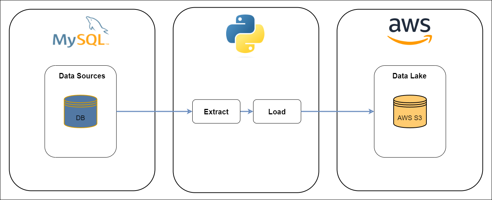

# World Data Pipeline

&nbsp;&nbsp;&nbsp;&nbsp;&nbsp;&nbsp;An EL pipeline that focus on extracting data from an On Premise MYSQL database and then load it to an S3 Bucket in AWS.

## Description

### Objetive
&nbsp;&nbsp;&nbsp;&nbsp;&nbsp;&nbsp;The project will move data from On Premise database to a Data Lake. The first step will be extracting the data from three different tables. Then create the connection to the S3 bucket to start loading the data. Finally, after successful storage of the data, the project objective is achieved.

### Dataset
&nbsp;&nbsp;&nbsp;&nbsp;&nbsp;&nbsp;The dataset used in this project is from a data that MYSQL database have.

### Tools & Technologies
* Cloud - [AWS Cloud](https://aws.amazon.com/)
* Data Lake - [AWS S3](https://aws.amazon.com/s3/?nc2=h_ql_prod_st_s3)
* Language - [Python](https://www.python.org/)

### Architecture

## Code

### Set Up AWS Keys

    config_content = open('config.json');
    config = json.load(config_content);
    access_key = config['access_key'];
    secret_access_key = config['secret_access_key'];

### Set Up SQL DB variables
    load_dotenv();

    user = os.environ.get("NAME");
    password = os.environ.get("PASSWORD");
    server = os.environ.get("HOST_NAME");
    db = os.environ.get("MYSQL_DATABASE");
    port = os.environ.get("MYSQL_PORT");

### Extract data from MYSQL
    def extract():
        try:
            engine = create_engine(f'mysql+pymysql://{user}:{password}@{server}:{port}/{db}')
            
            Session = scoped_session(sessionmaker(bind=engine))
            
            sec = Session()
            
            db_content = sec.execute(text(""" SELECT table_name FROM information_schema.tables WHERE table_schema = 'world' """))
            
            for table in db_content:
                df = pd.read_sql_query(f'select * FROM {table[0]}', engine)
                # Load Data
                load(df, table[0])
                
        except Exception as error:
            print("Data extract error: " + str(error));

### Load Data to AWS S3 Bucket
    def load(df, table):  
        try:
            print(f'Importing {len(df)} rows from table {table}');
            
            # Save to S3
            s3_bucket = 'world-data-bucket-18634';
            upload_file_key = 'public/' + str(table) + f"/{str(table)}";
            file_path = upload_file_key + ".csv";
            
            s3_client = boto3.client('s3', aws_access_key_id=access_key, aws_secret_access_key=secret_access_key, region_name='us-east-1');
            
            with io.StringIO() as csv_buffer:
                df.to_csv(csv_buffer, index=False);
                
                response = s3_client.put_object(
                    Bucket=s3_bucket, Key=file_path, Body=csv_buffer.getvalue()
                )
                
                status = response.get("ResponseMetaData", {}).get("HTTPStatusCode");
                
                if status == 200:
                    print(f"Succesful S3 response. Status = {status}");
                else:
                    print(f"Unuccesful S3 response. Status = {status}");                       
        except Exception as error:
            print("Data load error: " + str(error));
